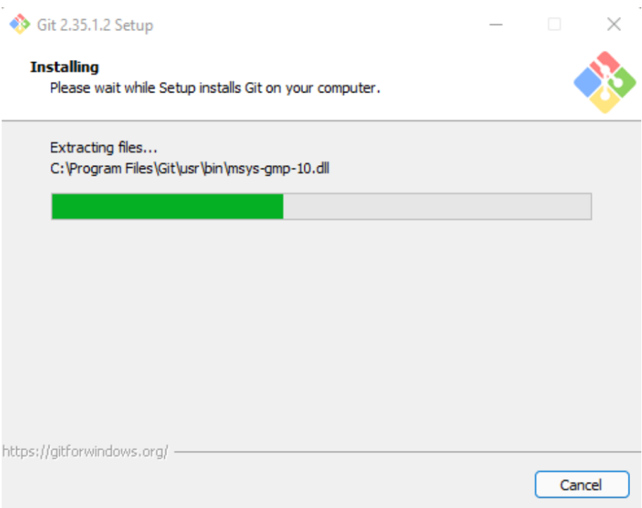
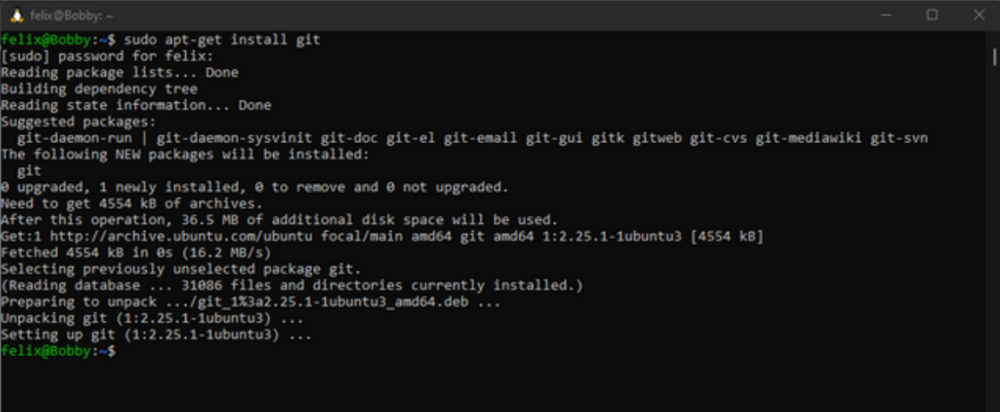

## On Windows

Download Git [here](https://git-scm.com/download/win). The page should automatically detect your system architecture and start the download. Just save the file.

> If your download doesn’t start automatically, choose from the 32-bit and 64-bit executable installer.

Open the executable and hit `Next`. Select the install location (we recommend leaving it at default). On the next page, choose your install preferences (e.g. if you want a desktop shortcut or integration with Windows Explorer). Hit `Next` and decide if you want a start menu folder.  

On the following pages, we recommend leaving all settings at default. Just hit `Next` and on the last page hit `Install`. The setup will now carry out the install. Click `Finish` to close the installer.

## On Mac

Download Git [here](http://git-scm.com/download/mac).

We recommend using the _**binary installer**_.

If you have experience with package managers like `Homebrew`, feel free to use that instead.The binary installer isn’t the latest release, but it’s enough for what we need.

The installer runs similarly to the one on Windows.

## On Linux

Download Git [here](https://git-scm.com/download/linux).  

The exact command to use for the installation depends on your distribution.

For Ubuntu/Debian based distros: `sudo apt-get install git`

