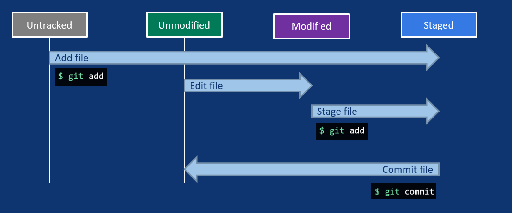

- [What is a Git Repository?](#what-is-a-git-repository)
- [Configuring Git](#configuring-git)
- [Creating a Repo](#creating-a-repo)
- [Best Practices](#best-practices)
- [Adding, Staging, Committing](#adding-staging-committing)
  - [File States in Git](#file-states-in-git)
- [Local vs. Remote Repositories](#local-vs-remote-repositories)
- [Collaboration](#collaboration)
  - [Forking](#forking)
  - [Invitations and Pull Requests](#invitations-and-pull-requests)
- [Cloning a Repo](#cloning-a-repo)
- [Pushing to a Remote](#pushing-to-a-remote)
- [Pulling from a Remote](#pulling-from-a-remote)
- [Linking a Local Repo to a Remote](#linking-a-local-repo-to-a-remote)
- [Further Links](#further-links)

***

## What is a Git Repository?

A repository tracks all changes made to files in a project by saving snapshots of the project's history.

It is represented by the hidden `.git` folder in the filesystem, and is also known as a **repo** for short.

***

## Configuring Git

When using Git for the first time, you need to set your **name** and **e-mail**.

Git uses this to identify who you are.

```bash
# set your name
git config --global user.name "your_name"

# set your email address
git config --global user.email "your_email"

# makes command line output colorful (increases readability)
git config --global color.ui auto
```

## Creating a Repo

```bash
# create an empty directory named git-workshop
mkdir git-workshop

# navigate to the directory
cd git-workshop

# initialise an empty repo
git init

# confirm that repo exists
git status
```

## Best Practices

After creating a new repo, you should do the following:

a. Add a README file

- a README is a short description of your project
- refer to [Make a README](https://www.makeareadme.com/) for a guide on creating a basic README

b. Add a .gitignore file

- a .gitignore file tells git to not track specified files
- refer to [GitHub's .gitignore Templates](https://github.com/github/gitignore) for a set of ready-made .gitignore files

## Adding, Staging, Committing

When you add a file, Git begins to track it.

A similar analogy would be adding items to a package that you want to mail to someone else later.

```bash
# creating a README in UNIX (Mac/Linux) 
touch README
echo "git-workshop" >> README

# creating a README in Windows
# use the file explorer to create a txt!

# is Git tracking the README?
git status

# add README to the staging area so that Git can track it 
git add README

# was the README added?
git status
```

What about adding multiple files?

```text
# of course, you can do it the painful way
git add file1
git add folder\file2

...

# there is however an easier way!

# the dot tells Git to add *everything* in the directory 
# *everything* includes files in subfolders too
git add .

```

Once you're done adding files, it's time to make a commit.

A commit is a snapshot of the current state of the repo.

Following the previous analogy, you are sealing and sending the package.

```bash
# the -m flag allows you to add a message to your commit 
git commit -m "Add README"

# how does the repo look like now?
git status

# check commit history
git log
```

### File States in Git



`untracked` - the file exists, but isn't tracked by Git yet.

`unmodified` - the file has not changed since the last commit.

`modified` - the file has content added/deleted/changed since the last commit.

`staged` - the file starts to be tracked and is ready to be included in the next commit.

***

## Local vs. Remote Repositories

So far, we have only been working on our local machine.
These are local repos.

What if we wanted to work on someone else's repo?
Or if we wanted to host our repo online to let others collaborate?

We do that by utilising remote repos.

Remote repos are hosted on websites such as [GitHub](https://github.com/) or [GitLab](https://about.gitlab.com/)

The THD has it's [own GitLab instance](https://mygit.th-deg.de/) where you can host your own projects on THD servers. You just need your student account credentials to log in.

## Collaboration

GitHub and GitLab offer fine-grained permissions for users to control who can contribute to their remote repositories.

As a rule, making a copy of the repository is allowed, but you cannot modify the repository's contents directly.

In order to modify a repository's contents, you need to either:

1. `Fork` it.
2. Get invited to collaborate.
3. Create a pull request.

### Forking

By forking a repository, you are making your own copy of the repository to do with as you please. This copy will be linked to the original. When the original repository has updates, you have the option to integrate them in your forked repo as well.

### Invitations and Pull Requests

You can request the repo owner to add you as a trusted collaborator, but this is rarely done in practice for bigger projects. Instead, you will be asked to do a pull request instead. We will not be covering this in detail, however.

## Cloning a Repo

By cloning a repo, you are copying a repo from an external source.
A directory created with all the files from the project after cloning.

What are external sources?
These are repos hosted on the web through platforms such as GitHub or GitLab.

The two main ways to clone a repo are with either HTTPS or SSH.
These methods are essentially the same for our purposes. We will be using HTTPS.

To get the URL, click on the green `CODE` button on a GitHub repo (`CLONE` on GitLab).

Copy the URL shown under the HTTPS tab.

```bash
# clone a repo 
git clone <url_for_remote_repo>

# navigate to the repo's folder
cd folder-name
```

## Pushing to a Remote

Pushing = Adding the local commits you made to the project to the remote repo.

```bash
git push <remote> <branch>
```

## Pulling from a Remote

Pulling = Updates the local copy with new changes from the remote.

There are 2 ways to do this.

```bash
# downloads all changes, but does not combine the changes to your local copy
git fetch

# combines changes into local copy
git merge

# both fetch and merge in one command
git pull
```

## Linking a Local Repo to a Remote

```bash
# add remote repo url to local repo
git remote add origin [url]

# at this point you might be prompted to authenticate with GitHub/GitLab

# push and create corresponding branch in remote
git push --set-upstream origin main
```

## Further Links

[Pro Git](https://git-scm.com/book/en/v2) - A book that goes in-depth on everything Git has to offer.

[Oh Shit, Git!?!](https://ohshitgit.com/) - For times when you screw up and don't know what to do.

[GitHub's .gitignore Templates](https://github.com/github/gitignore) - .gitignore templates from Github.

[Writing Good Commit Messages](https://cbea.ms/git-commit/) - an art in of itself.